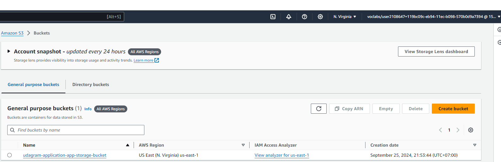

# CD12352 - Infrastructure as Code Project Solution
# [Hung Doan]

## Spin up instructions
* Open Git Bash console application, jump into cloudFormation directory and then execute the shell script below
  `./execute-script.sh deploy network network.yml network-parameters.json us-east-1`

  `./execute-script.sh deploy udagram udagram.yml udagram-parameters.json us-east-1`

## Tear down instructions
* Do the same steps above but executing the shell script below

  `./execute-script.sh delete network network.yml network-parameters.json us-east-1`

  `./execute-script.sh delete udagram udagram.yml udagram-parameters.json us-east-1`

## Some screenshot
* Udagram application Infrastructure diagram

* Execution shell script

* Stacks has been created succesful

* S3 Bucket

* Static web content

## Static Web Link
http://udagra-myloa-mz4rmsztul5u-569572535.us-east-1.elb.amazonaws.com/